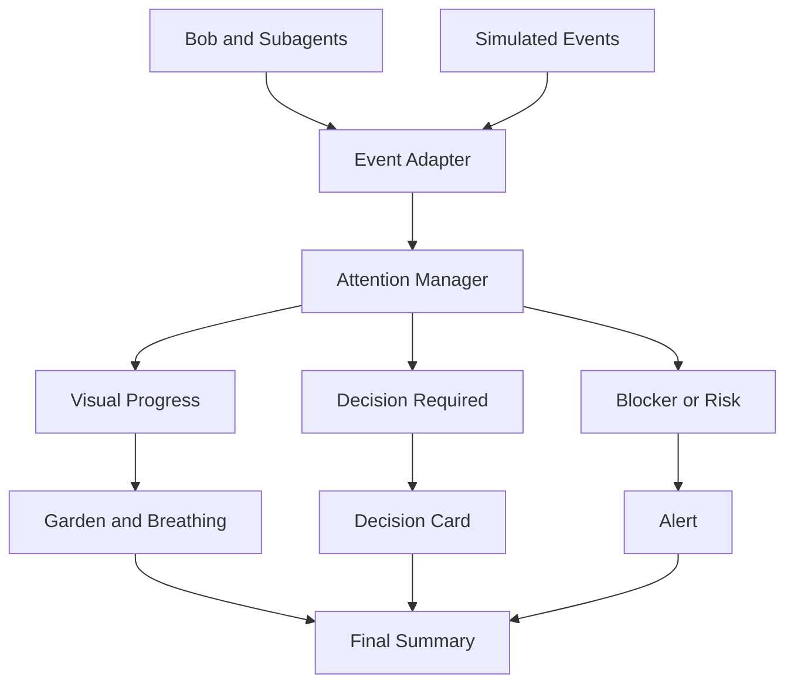

# Bob Break

## While Bob Works, You Breathe

Bob Break is a developer attention management system designed for IBM Bob 2.0.

It transforms autonomous AI processing time into a calm visual recovery experience while keeping developers informed and in control.

> **Bob reduces the workload. Bob Break reduces the cognitive load.**

## The Problem

AI development agents can generate code, plans, logs, test results, and documentation faster than developers can comfortably process them.

Developers often feel compelled to monitor every update:

- Is the agent still working?
- Is a task blocked?
- Does Bob need a decision?
- Has an important error appeared?
- Can I safely look away?

Even when AI is performing the work, the developer's eyes and brain rarely get a genuine break.

This creates:

- Visual fatigue.
- Cognitive overload.
- Repeated progress checking.
- Unnecessary interruptions.
- Context switching.
- Important information becoming lost in technical noise.

> **The bottleneck is no longer how fast AI can generate code. It is how much information a human developer can process without becoming overwhelmed.**

## The Solution

Bob Break converts Bob's agent activity into calm, understandable visual progress.

An Attention Manager classifies each event generated by Bob and its subagents:

- **Progress:** represented visually without displaying technical noise.
- **Decision:** presents one concise question to the developer.
- **Blocked:** explains what is preventing an agent from continuing.
- **Risk:** immediately requests human attention.
- **Completed:** updates the garden and contributes to the final summary.

Routine technical updates remain available, but they do not continuously occupy the main interface.

## How It Works

