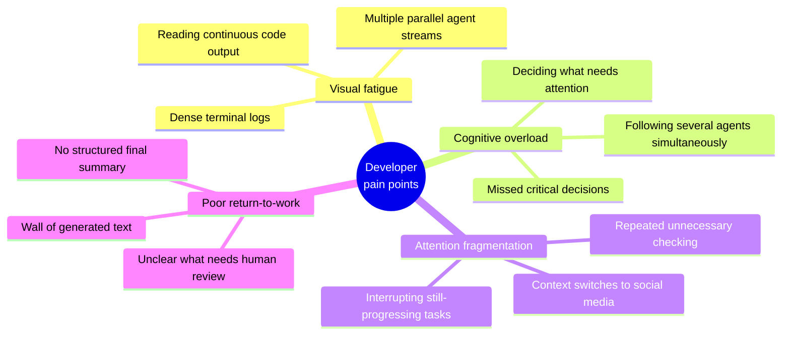
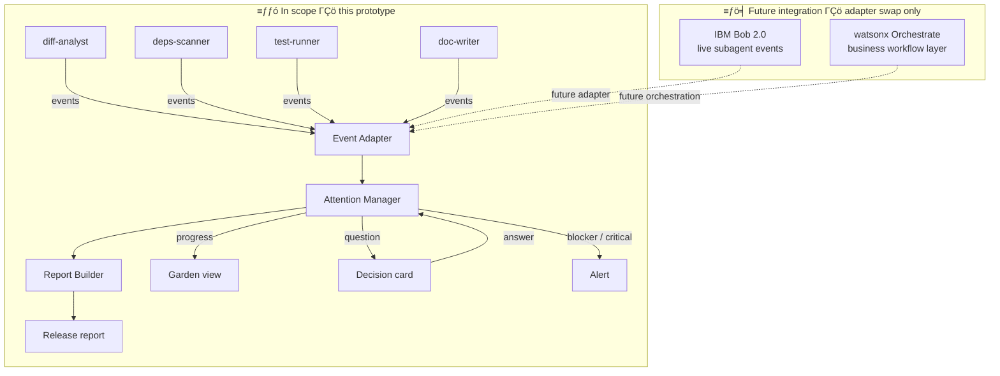
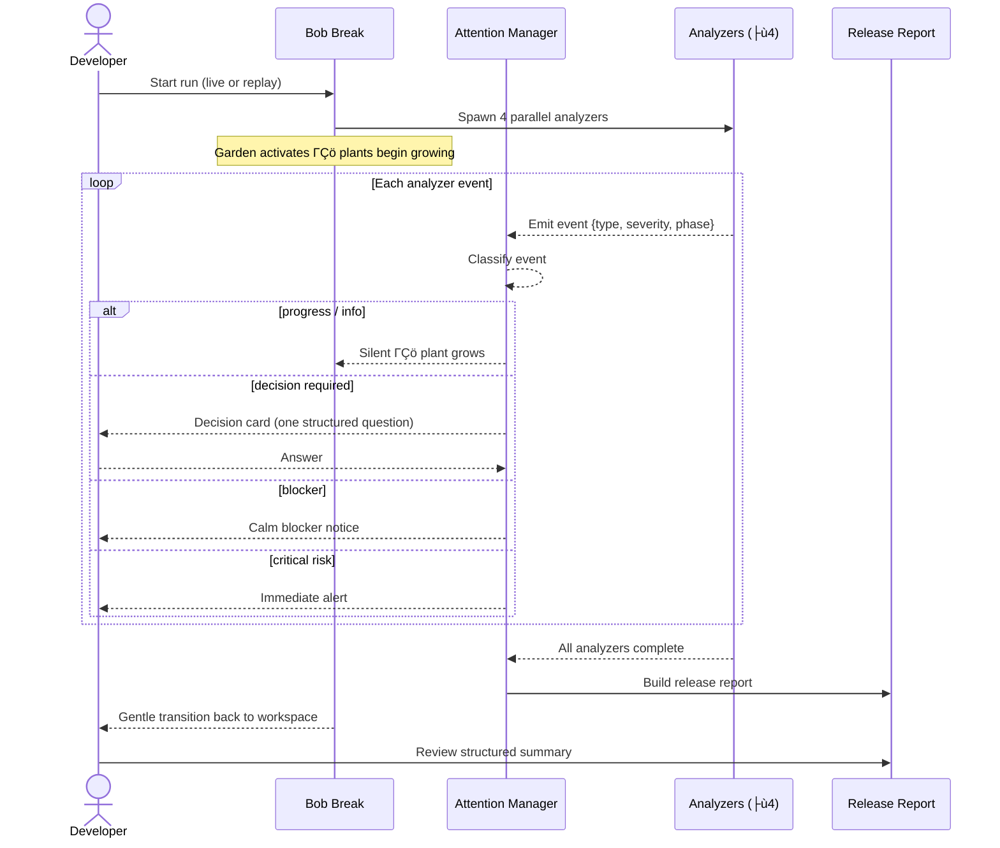
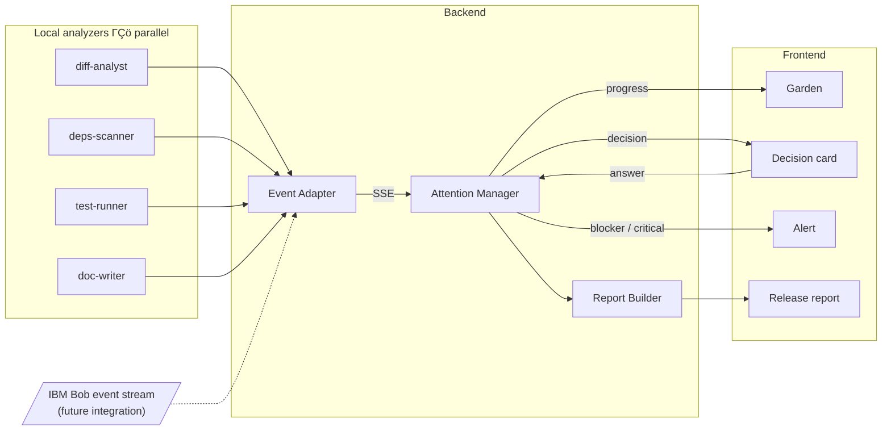
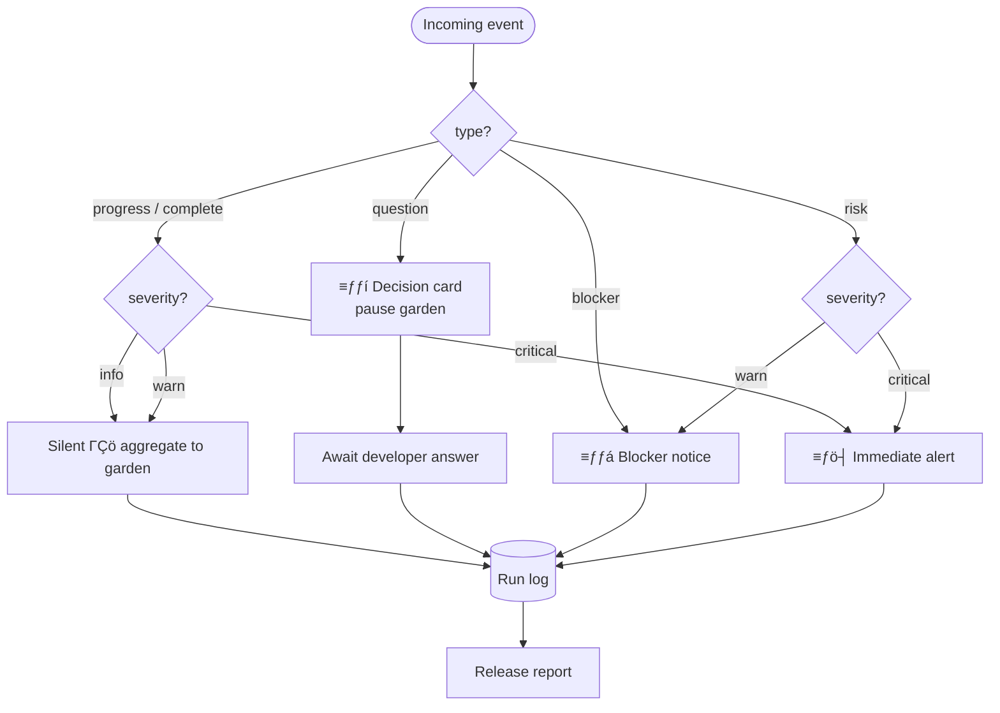
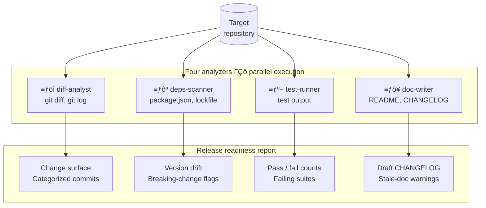
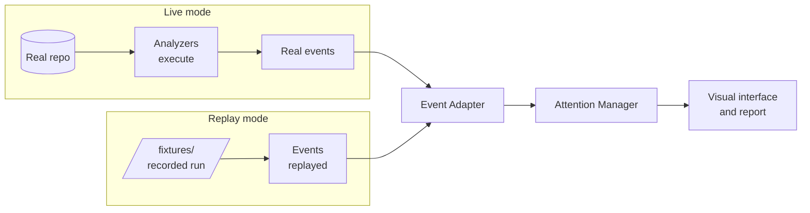
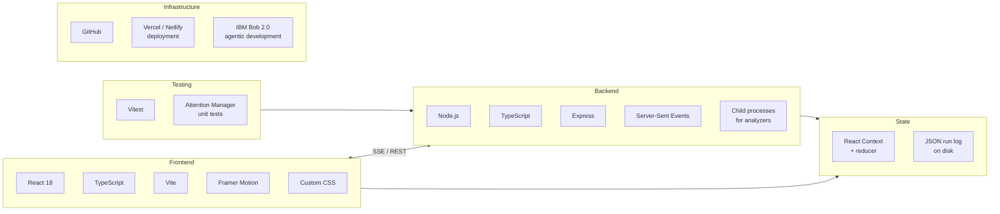
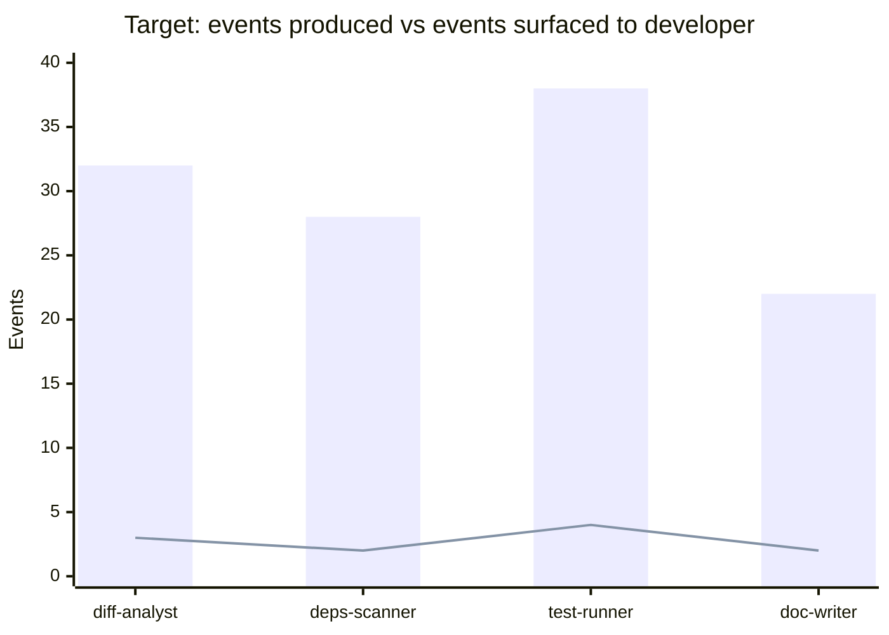
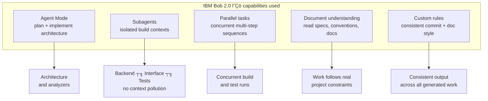

# Bob Break

**A developer attention management system for agentic AI.**
While Bob works, you breathe.

Submission for the **IBM TechXchange 2026 Pre-conference Dev Day Hackathon** ΓÇö theme: *Build with purpose using IBM Bob 2.0*.

---

## Table of contents

1. [The problem](#the-problem)
2. [The solution](#the-solution)
3. [Project scope](#project-scope)
4. [User journey](#user-journey)
5. [Architecture](#architecture)
6. [Event classification](#event-classification)
7. [The workload: Release Readiness Assistant](#the-workload-release-readiness-assistant)
8. [Event contract](#event-contract)
9. [API surface](#api-surface)
10. [Live mode and replay mode](#live-mode-and-replay-mode)
11. [Tech stack](#tech-stack)
12. [Measuring the impact](#measuring-the-impact)
13. [Repository layout](#repository-layout)
14. [Running locally](#running-locally)
15. [How IBM Bob 2.0 was used](#how-ibm-bob-20-was-used)
16. [Submission deliverables](#submission-deliverables)
17. [Team](#team)

---

## The problem

The bottleneck in AI-assisted development is no longer how fast an agent can generate code. It is how much information a human developer can process without becoming overwhelmed.

When IBM Bob runs a multi-step task across several subagents, it produces a continuous stream of plans, updates, questions, diffs, and test results. The developer feels compelled to watch all of it:

- Is Bob still working?
- Is one of the agents blocked?
- Did an important error appear?
- Can I safely look away?

The result is visual fatigue, cognitive overload, repeated checking, unnecessary context switching, and interruptions to processes that were progressing correctly. **AI saves development time, but that saved time becomes anxious waiting.**



---

## The solution

Bob Break is an attention-management layer for agentic development workflows. It observes a real release-readiness pipeline, classifies every event by whether a human actually needs it, and renders the run as a calm visual state instead of a log stream.

The developer is interrupted only when human input provides real value:

| Event class | What the developer sees |
| --- | --- |
| Background progress | Silent aggregation ΓÇö a plant grows in the garden |
| Decision required | The garden pauses; one short, structured question |
| Blocked task | A calm notice naming exactly what is stuck |
| Critical risk | An immediate alert |

Everything else is held for the **release report** ΓÇö the structured summary that brings the developer back to the code with a clear picture of what changed, what passed, what remains risky, and what needs review.

> Bob reduces the workload. Bob Break reduces the cognitive load.

---

## Project scope

The diagram below shows every component in scope for this prototype, and how it connects to a future full IBM Bob integration.



**Scope boundaries:**
- The prototype runs four local analyzers that emit the shared event format.
- The Attention Manager, Report Builder, and all visual components are fully functional.
- IBM Bob built everything in scope; no future integration is claimed as current functionality.

---

## User journey



---

## Architecture



Two things this diagram is saying deliberately:

- The **Event Adapter** is the only component that knows where events come from. A future Bob event integration would replace the adapter's input without changing the Attention Manager, the report builder, or the visual interface. That is why the seam exists.
- The **Attention Manager** is a pure function from event to route. It is the core of the system and the part that is unit tested.

IBM Bob 2.0 planned, built, tested, and documented every box in this diagram. See [How IBM Bob 2.0 was used](#how-ibm-bob-20-was-used).

---

## Event classification

The Attention Manager routes every incoming event through a single decision tree. This keeps the classifier stateless and unit-testable.



### Visual states

| Garden state | What it means |
| --- | --- |
| 🌱 Seedling | Analyzer planned, not yet started |
| 🌿 Growing | Analyzer working — progress events arriving |
| ⏸️ Paused | Waiting for a developer decision |
| 🍂 Wilting | Analyzer blocked |
| 🌸 Flowering | Analyzer completed successfully |
| ✨ Fireflies | All analyzers done — transitioning to report |

---

## The workload: Release Readiness Assistant

Bob Break is not a wellness widget sitting next to an agent ΓÇö it visualizes real work. The work in this prototype is **release readiness**, one of the most manual and error-prone gates in the SDLC.

At runtime the prototype executes **four local analyzers in parallel** against a target repository. Each one emits events as it goes and contributes a section to the report.



Bob Break's final summary and the Release Readiness report are the same artifact. One pipeline produces it.

---

## Event contract

Every component on both sides of the seam keys off this one shape.

```json
{
  "id": "evt_0042",
  "runId": "run_01",
  "ts": "2026-08-30T02:14:08.331Z",
  "analyzer": "deps-scanner",
  "phase": "analyzing",
  "type": "progress",
  "severity": "info",
  "title": "3 minor version bumps detected",
  "detail": "…full technical text, never shown unprompted…",
  "decision": null
}
```

| Field | Values |
| --- | --- |
| `analyzer` | which local analyzer emitted the event |
| `phase` | `planned` ┬╖ `working` ┬╖ `waiting` ┬╖ `blocked` ┬╖ `done` |
| `type` | `progress` ┬╖ `question` ┬╖ `blocker` ┬╖ `risk` ┬╖ `complete` |
| `severity` | `info` ┬╖ `warn` ┬╖ `critical` |
| `decision` | `null`, or `{ question, options[] }` when developer input is required |

The format is deliberately source-agnostic. Any producer that can emit this shape ΓÇö a local analyzer today, an agent event stream later ΓÇö works without changes downstream.

---

## API surface

| Route | Method | Purpose |
| --- | --- | --- |
| `/api/runs` | `POST` | Start a run ΓÇö `{ mode: "live" \| "replay" }` |
| `/api/runs/:id/stream` | `GET` | Server-sent event stream |
| `/api/runs/:id/decisions` | `POST` | Submit an answer to a decision card |
| `/api/runs/:id/report` | `GET` | The release readiness report |
| `/api/health` | `GET` | Liveness |

---

## Live mode and replay mode

The prototype runs in two modes, and the difference is stated plainly because it matters:

- **`live`** ΓÇö the four analyzers execute against a real target repository and emit real events as they run.
- **`replay`** ΓÇö the backend replays a recorded run of those same analyzers. Deterministic, used for the demo video so a recording never depends on a live run succeeding.



Both modes exercise the identical Event Adapter, Attention Manager, and interface. Replay changes where the events come from, nothing else.

**What this prototype does not do:** it does not attach to a running IBM Bob IDE process or receive live subagent events. No such hook is claimed. Bob's role in this project is described below, and a future Bob event integration is an adapter swap rather than a redesign.

---

## Tech stack



| Layer | Technology | Reason |
| --- | --- | --- |
| Frontend | React 18 + TypeScript + Vite | Fast, visual, easy to divide across team members |
| Styling | Custom CSS with variables | Greater control with less configuration |
| Animations | Framer Motion | Garden growth, breathing animations, transitions |
| State | React Context + reducer | Sufficient for an MVP ΓÇö no external store needed |
| Events | JSON + Event Adapter | Supports both real and simulated events |
| Testing | Vitest + Testing Library | Simple integration with Vite |
| End-to-end | Playwright (time permitting) | Demonstrates the complete workflow |
| Repository | GitHub | Collaboration and project submission |
| Deployment | Vercel, Netlify, or GitHub Pages | Fast and simple deployment |
| Agentic development | IBM Bob 2.0 | Planning, subagents, code generation, testing, documentation |

---

## Measuring the impact

The prototype instruments itself rather than asserting productivity gains:

- events emitted by the pipeline
- events surfaced to the developer
- interruptions requiring human input
- time from run start to a reviewable report

The headline number is the ratio: **how many events the run produced versus how few reached the developer.**



> *Bar = total events produced by each analyzer. Line = events surfaced to the developer. Figures are design targets, not measured results.*

### Traditional workflow vs Bob Break targets

| Metric | Traditional agent workflow | Bob Break target |
| --- | --- | --- |
| Progress checks | Frequent | Only when necessary |
| Context switches | 4ΓÇô6 | 0ΓÇô1 |
| Intermediate output reviewed | Almost everything | Only actionable information |
| Continuous technical-text exposure | High | Significantly reduced |
| Intentional visual recovery | None | 30ΓÇô90 seconds |
| Visibility across parallel agents | Fragmented | Unified |
| Final review | Unstructured output | Progressive summary |

> Figures in the concept document comparing traditional agent workflows to Bob Break are design targets, not measured results.

---

## Repository layout

```
/server        backend ΓÇö analyzers, event adapter, attention manager, report builder
/web           frontend ΓÇö garden, decision cards, alerts, report view
/fixtures      recorded analyzer run used by replay mode
/evidence      IBM Bob task session summary screenshots
/docs          problem & solution statements, Bob usage statement
```

---

## Running locally

```bash
npm install
npm run dev
```

The frontend runs on `http://localhost:5173` and the backend on `http://localhost:3000`.

To run against your own repository in live mode, set the target before starting the server:

```bash
TARGET_REPO=/path/to/repo npm run dev
```

Without `TARGET_REPO`, the server starts in replay mode using the recorded run in `/fixtures`.

---

## How IBM Bob 2.0 was used

IBM Bob Agent mode and subagents were used to plan, build, test, and document the release-readiness workflow. At runtime, the prototype executes four local analyzers in parallel and translates their activity into a shared event format. Replay mode provides a deterministic demonstration of the same workflow. A future Bob event integration would replace the current adapter without changing the Attention Manager or visual interface.



Specifically:

- **Agent mode** ΓÇö planned the architecture and implemented the analyzers, the event pipeline, and the frontend components
- **Subagents** ΓÇö isolated each build task in a self-contained context so work on the backend, the interface, and the tests did not pollute one another
- **Parallel tasks** ΓÇö ran multi-step build and test sequences concurrently across the codebase
- **Document understanding** ΓÇö read the project's own specifications, conventions, and existing documentation so generated work followed the real constraints instead of treating each request as an isolated coding task
- **Custom rules** ΓÇö enforced consistent commit categorization and documentation style across everything Bob generated

> **TODO before submission:** replace this list with the specific tasks Bob performed, and confirm the exported task session summary screenshots are committed under `/evidence`.

---

## Submission deliverables

- [ ] Video demonstration, including how IBM Bob was used
- [ ] Written problem and solution statements ΓÇö `/docs`
- [ ] Written statement on how IBM Bob was utilized ΓÇö `/docs`
- [ ] Working code repository with exported Bob task session summary screenshots ΓÇö `/evidence`

---

## Team

| Role | Owner |
| --- | --- |
| Backend ΓÇö analyzers, event stream, attention manager | *TBD* |
| Frontend ΓÇö garden, decision cards, report view | *TBD* |
| Evidence, written statements, video | *TBD* |

---

Built with IBM Bob 2.0 for the IBM TechXchange 2026 Pre-conference Dev Day Hackathon.
