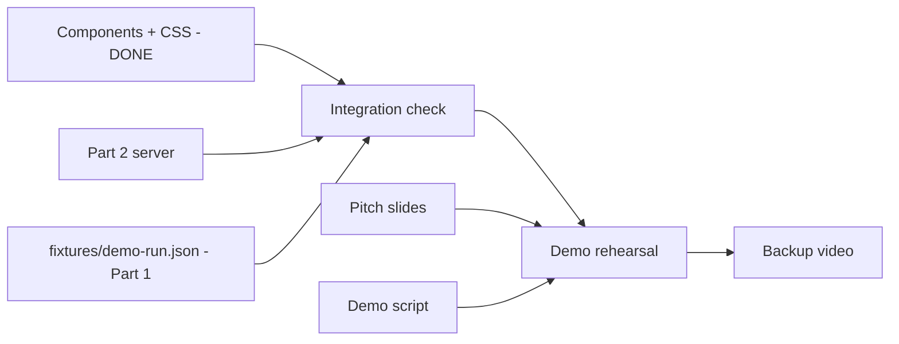

# Plan — Part 3: Visual Recovery Experience and Presentation

> **Owner:** Team Member 3 · **Branch:** `feature/visual-experience`
>
> **Read first — mandatory:**
> - [`docs/development-work-split.md`](./development-work-split.md) — full responsibilities, deliverables, and acceptance criteria for Part 3.
> - [`docs/design-brief.md`](./design-brief.md) — IBM Carbon Design Brief. All visual decisions trace to this document.
> - [`docs/plan-carbon-migration.md`](./plan-carbon-migration.md) — the detailed CSS migration plan (8 sub-tasks) already approved.
>
> **Context from other Bob agents:**
> - **Part 2 plan** → [`docs/plan-express-server.md`](./plan-express-server.md): the Express SSE server that feeds `RunState` to the frontend. Part 3 consumes `RunState` via `RunContext`.
> - **Part 1 plan** (pending): produces `fixtures/demo-run.json` — the event sequence that drives the live demo.
>
> **Integration contract (do not change without team agreement):**
> All components consume `RunState` and `ReleaseReport` from `server/src/types/bob-events.ts`.
> The `BobEvent` and `ReleaseReport` shapes are frozen.

---

## Overview

Part 3 owns the entire visual layer of Bob Break — the interface that transforms an analyzer
event stream into a calm, human-friendly experience. The work splits into three areas:

1. **Components and styles** — the six React components, three CSS files, and App shell.
   Based on the exploration of the codebase, this area is **already complete**.
2. **Integration wiring** — connecting the complete UI to the running server (Part 2).
   Requires Part 2's server to be running; can be tested end-to-end once Sub-Task 5 of Part 2 is done.
3. **Presentation and demo** — pitch slides, demo script, and backup video.
   Independent of the other two areas; can be done in parallel.

---

## Sub-Task 1 — Verify component completeness against acceptance criteria

**Status:** `[ ] pending`

**Intent**
The six components and three CSS files have been implemented. Before moving forward,
do a targeted audit against the Part 3 acceptance criteria in `development-work-split.md`
to confirm every item is satisfied and nothing was missed.

**Expected outcomes**
- Confirm that `AgentGarden` renders one plant per `AnalyzerId` (diff-analyst, deps-scanner,
  test-runner, doc-writer).
- Confirm that plant progress is driven by `RunState.analyzers[id].progress` (0–100).
- Confirm all five plant states are visually distinct and transition smoothly.
- Confirm `DecisionCard` is shown only when `RunState.pendingDecision` is non-null.
- Confirm `DecisionCard` emits a `SUBMIT_ANSWER` action that reaches `attentionReducer`.
- Confirm `RiskAlert` uses a calm colour palette — no alarming red fill.
- Confirm `CompletionSummary` renders the `ReleaseReport` with no raw JSON visible.
- Confirm breathing animation plays automatically during `RunState.status === "running"`.
- Confirm interface is usable at 1280 × 800 and at 375 px mobile width.
- Confirm primary garden view has no axe accessibility violations (manually or with browser extension).

**Todo**
1. Open `web/src/components/AgentGarden.tsx` — verify the four `AnalyzerId` values are
   rendered in fixed order and `paused` prop is set when `status === "waiting-for-decision"`.
2. Open `web/src/components/AgentPlant.tsx` — verify the five plant states (seedling, growing,
   paused, blocked, completed) and that the progress bar has `role="progressbar"` with
   `aria-valuenow`, `aria-valuemin`, `aria-valuemax`, `aria-label`.
3. Open `web/src/components/DecisionCard.tsx` — verify it reads `pendingDecision` from
   `RunContext` and dispatches `SUBMIT_ANSWER` on submit.
4. Open `web/src/components/RiskAlert.tsx` — verify calm colour palette (amber/border-only,
   no red fill) and `role="alert"` or `aria-live="assertive"`.
5. Open `web/src/components/CompletionSummary.tsx` — verify it receives `ReleaseReport`,
   renders it in human-readable form, and includes the three action buttons.
6. Open `web/src/components/BreathingCircle.tsx` — verify `aria-hidden="true"` on animation,
   `prefers-reduced-motion` fallback, and dark island wrapper.
7. Open `web/src/App.tsx` — verify the three state transitions:
   `idle → running/waiting-for-decision → completed`.
8. Run the app (`npm run dev` in `/web`) and do a quick visual check at 1280 px and 375 px.
9. Record any gaps as follow-up items in this plan.

**Relevant context**
- Acceptance criteria: `docs/development-work-split.md` § Part 3
- Components: [`web/src/components/`](../web/src/components/)
- App shell: [`web/src/App.tsx`](../web/src/App.tsx)
- CSS: [`web/src/styles/`](../web/src/styles/)

---

## Sub-Task 2 — Carbon migration verification

**Status:** `[ ] pending`

**Intent**
The detailed CSS migration plan in `docs/plan-carbon-migration.md` (8 sub-tasks) is the
authoritative checklist for the visual migration. This sub-task is a focused pass to
confirm all 8 sub-tasks from that plan are fully applied and the acceptance checklist
at the bottom of that document is green.

**Expected outcomes**
- `body` background is `#f4f4f4` — no dark background except the recovery panel.
- IBM Plex Sans renders for all UI text; IBM Plex Mono for analyzer IDs and counters.
- Agent tiles are white with Carbon status border-left colours.
- Plant stem is IBM Blue during `working`, green when `done`, amber when `blocked`.
- Decision card is white with blue top accent — no amber border.
- Risk alert is white with left-border severity indicator — no coloured fill.
- Recovery panel is Gray 100 dark island within the light page.
- Breathing animation stops and static text appears with `prefers-reduced-motion`.
- Completion summary uses white cards, IBM Blue metric values, and three action buttons.
- All interactive elements show `#0f62fe` focus ring on keyboard focus.
- `AgentPlant` progress bar has `role="progressbar"` with correct aria attributes.

**Todo**
1. Read `docs/plan-carbon-migration.md` in full.
2. Check each of the 8 sub-tasks in that plan against the live CSS files.
3. For any sub-task not yet applied, implement the changes described in that sub-task.
4. Run the app and verify the acceptance checklist at the bottom of
   `docs/plan-carbon-migration.md` visually.
5. Mark sub-tasks done in `docs/plan-carbon-migration.md` as completed.

**Relevant context**
- Migration plan: [`docs/plan-carbon-migration.md`](./plan-carbon-migration.md)
- Design brief: [`docs/design-brief.md`](./design-brief.md)
- CSS files: [`web/src/styles/interface.css`](../web/src/styles/interface.css),
  [`web/src/styles/garden.css`](../web/src/styles/garden.css),
  [`web/src/styles/breathing.css`](../web/src/styles/breathing.css)
- HTML: [`web/index.html`](../web/index.html)

---

## Sub-Task 3 — End-to-end integration test with the server

**Status:** `[ ] pending`

**Depends on:** Part 2 server (`plan-express-server.md`) being implemented and runnable.

**Intent**
Run the full stack (server + frontend) and verify that all eight steps of the demo
sequence in `development-work-split.md` play out correctly in the browser.

**Expected outcomes**
- `npm run dev` in `/server` and `/web` both start without errors.
- Clicking "Start run" sends `POST /api/runs`, receives a run ID, opens the SSE stream.
- All four plants start at seedling and begin growing from `progress` events.
- Breathing circle appears and animates during the running state.
- Decision card appears when the `question` event fires (pauses the garden).
- Submitting an answer resumes the garden.
- Risk alert appears calmly for the `blocker`/`risk` event.
- All four plants flower and the completion summary renders with a valid `ReleaseReport`.
- No raw JSON or stack traces visible to the user at any point.

**Todo**
1. Start the server: `cd server && npm run dev`.
2. Start the frontend: `cd web && npm run dev`.
3. Open the browser and walk through the full demo sequence step by step.
4. Use browser DevTools to confirm SSE messages arrive with the correct event structure.
5. Check the CompletionSummary renders human-readable text, not raw JSON.
6. Note any integration bugs and fix them in the relevant component or CSS file.
7. Record a short screen capture of the successful end-to-end run for evidence.

**Relevant context**
- Demo sequence: `docs/development-work-split.md` § Demo Sequence
- Fixture: [`fixtures/demo-run.json`](../fixtures/demo-run.json)
- Vite proxy config: [`web/vite.config.ts`](../web/vite.config.ts) (proxies `/api` → `localhost:3000`)
- Frontend context: [`web/src/context/RunContext.tsx`](../web/src/context/RunContext.tsx)

---

## Sub-Task 4 — Demo script

**Status:** `[ ] pending`

**Intent**
Write the live presentation script. The script must cover the full 60–90-second demo
sequence from `development-work-split.md` and give the presenter clear spoken cues
for each visual moment.

**Expected outcomes**
- A `docs/demo-script.md` file exists.
- The script maps every spoken sentence to a visual moment in the demo sequence table.
- The script includes:
  - Opening: what Bob Break is and why it matters (15–20 seconds).
  - Demo walkthrough: 8 steps from the demo sequence table.
  - Closing: what the developer experienced vs what they would have seen without Bob Break.
- The script is short enough to fit comfortably in 90 seconds of live speaking.
- Presenter notes indicate when to click, when to wait, and what the audience should see.

**Todo**
1. Create `docs/demo-script.md`.
2. Write the opening paragraph (problem statement — developer attention and cognitive load).
3. Write a spoken line for each of the 8 steps in the demo sequence table.
4. Write the closing paragraph (Bob Break value: calm interface, guided breathing,
   structured completion summary).
5. Add presenter notes in parentheses for each visual transition.

**Relevant context**
- Demo sequence: `docs/development-work-split.md` § Demo Sequence (8 steps, 60–90 s)
- Product pitch: [`Bob Break_ While Bob Works, You Breathe (2).pdf`](../Bob%20Break_%20While%20Bob%20Works%2C%20You%20Breathe%20%282%29.pdf)

---

## Sub-Task 5 — Backup demo video

**Status:** `[ ] pending`

**Depends on:** Sub-Task 3 (integration working end-to-end).

**Intent**
Record a backup demo video using replay mode (`speedMultiplier = 1`) so the presentation
does not depend on a live server or internet connection on the day.

**Expected outcomes**
- A video file exists at `evidence/demo-video.mp4` (or a link to it).
- The video covers all 8 steps of the demo sequence.
- No live repo or network connection is required to play the video.
- `speedMultiplier = 1` is used — the full 60–90-second sequence plays at real speed.
- The video includes audio narration following the demo script from Sub-Task 4.

**Todo**
1. Confirm replay mode is working (`speedMultiplier = 1` in the server adapter call).
2. Use a screen recorder (OBS, macOS QuickTime, or equivalent) to capture the full run.
3. Narrate using the demo script from `docs/demo-script.md`.
4. Export to `evidence/demo-video.mp4` or upload to a shareable link and record it in
   `evidence/README.md`.
5. Watch the recording once to verify all 8 demo steps are clearly visible.

**Relevant context**
- Replay mode: `server/src/adapters/replayEventAdapter.ts`
- Fixture: [`fixtures/demo-run.json`](../fixtures/demo-run.json)
- Demo sequence: `docs/development-work-split.md` § Demo Sequence

---

## Sub-Task 6 — Pitch slides

**Status:** `[ ] pending`

**Intent**
Create the presentation slides for the hackathon demo. The slides support the spoken demo
script — they are not a replacement for it.

**Expected outcomes**
- A slide deck exists at `docs/pitch-slides.pdf` (or equivalent format).
- Slide count: 5–8 slides maximum.
- Mandatory slides:
  1. **Title** — "Bob Break: While Bob Works, You Breathe"
  2. **Problem** — developer attention interrupted by AI agent noise
  3. **Solution** — calm garden UI, breathing recovery, structured completion
  4. **Architecture** — simple diagram: Bob agents → Event stream → Bob Break UI
  5. **Live demo** — placeholder slide shown during the live walkthrough
  6. **Results** — one slide showing the completion summary screenshot
- IBM Carbon light theme visual style consistent with the UI.

**Todo**
1. Create slides using any tool (Google Slides, Keynote, PowerPoint, Canva).
2. Follow IBM Carbon light theme: white/Gray 10 backgrounds, IBM Blue accents,
   IBM Plex Sans font.
3. Export to PDF and save at `docs/pitch-slides.pdf`.
4. Optionally add screenshots of the running UI to the demo and results slides.

**Relevant context**
- Existing submission document: [`Bob Break_ While Bob Works, You Breathe (2).pdf`](../Bob%20Break_%20While%20Bob%20Works%2C%20You%20Breathe%20%282%29.pdf)
- Tech stack diagram: [`Bob_Break_tech_stack.png`](../Bob_Break_tech_stack.png)
- Flow diagram: [`Bob_Break_flow.png`](../Bob_Break_flow.png)

---

## Acceptance Criteria Checklist

These map directly to the Part 3 criteria in `docs/development-work-split.md`.

### Visual / component
- [ ] Garden renders one plant per `AnalyzerId`: diff-analyst, deps-scanner, test-runner, doc-writer.
- [ ] Plant progress is driven by `RunState.analyzers[id].progress` (0–100).
- [ ] All five plant states are visually distinct and transition smoothly.
- [ ] `DecisionCard` is shown only when `RunState.pendingDecision` is non-null.
- [ ] `DecisionCard` emits an answer that reaches `attentionReducer` as a `SUBMIT_ANSWER` action.
- [ ] `RiskAlert` uses a calm colour palette — no alarming red fill.
- [ ] `CompletionSummary` renders the `ReleaseReport`; no raw JSON visible.
- [ ] Breathing animation plays automatically during `RunState.status === "running"`.
- [ ] Interface is usable at 1280 × 800 and at 375 px mobile width.
- [ ] Primary garden view has no axe accessibility violations.

### Carbon design
- [ ] `body` background is `#f4f4f4` — no dark background except the recovery panel.
- [ ] IBM Plex Sans renders for all UI text.
- [ ] IBM Plex Mono renders for analyzer IDs, counters, and technical labels.
- [ ] Agent tiles are white with Carbon status left-border colours.
- [ ] Plant stem is IBM Blue during `working`, green when `done`, amber when `blocked`.
- [ ] Decision card is white with blue top accent — no amber border.
- [ ] Risk alert is white with left-border severity indicator — no coloured fill.
- [ ] Recovery panel is Gray 100 dark island within the light page.
- [ ] Breathing animation stops and static text appears with `prefers-reduced-motion`.
- [ ] Completion summary uses white cards, IBM Blue metric values, and three action buttons.
- [ ] All interactive elements show `#0f62fe` focus ring on keyboard focus.

### Presentation
- [ ] `docs/demo-script.md` covers all 8 demo sequence steps.
- [ ] `docs/pitch-slides.pdf` (or equivalent) exists with the 5–8 mandatory slides.
- [ ] Backup demo video exists at `evidence/demo-video.mp4` (or linked in `evidence/README.md`).
- [ ] Demo video recorded with `speedMultiplier = 1` in replay mode (no live repo needed).
